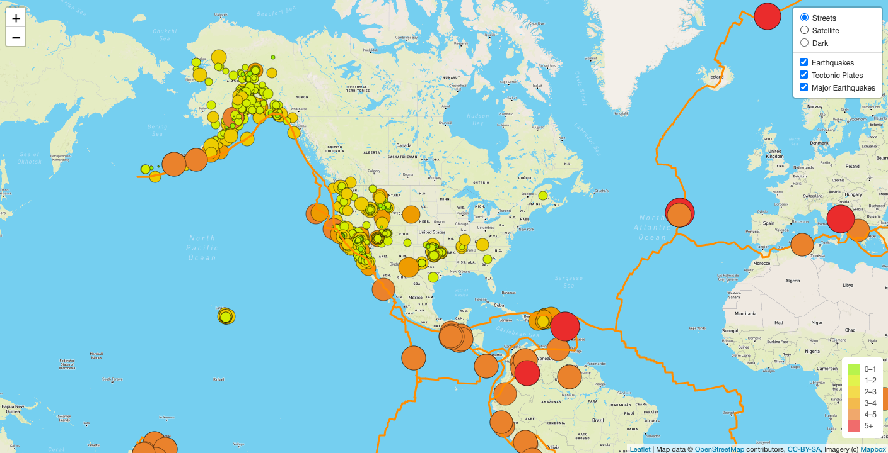
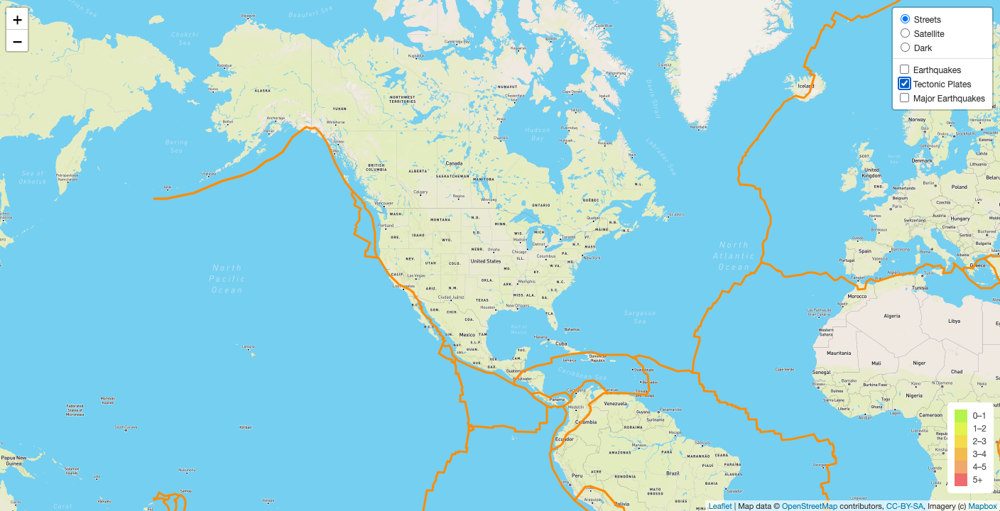
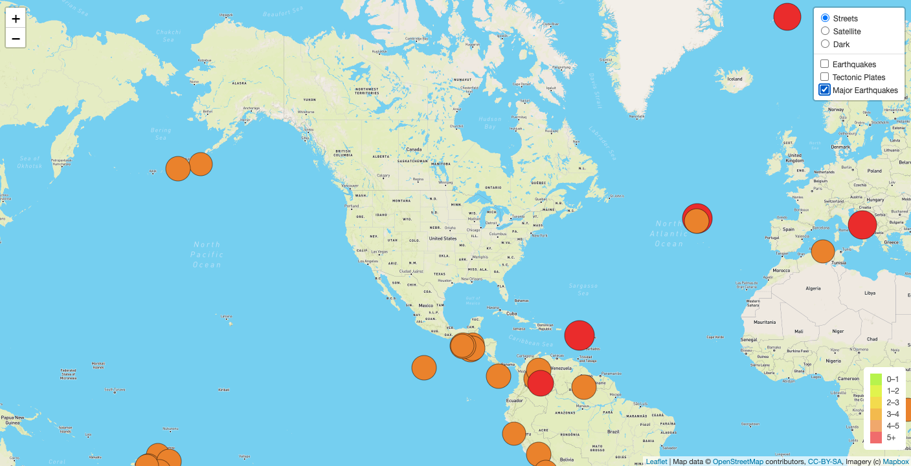
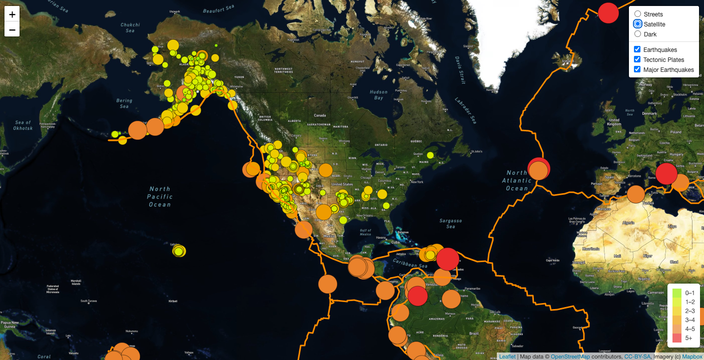
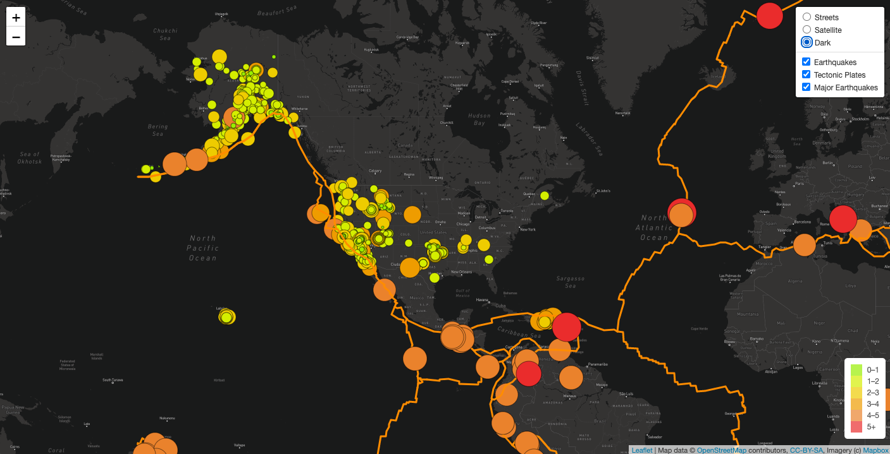
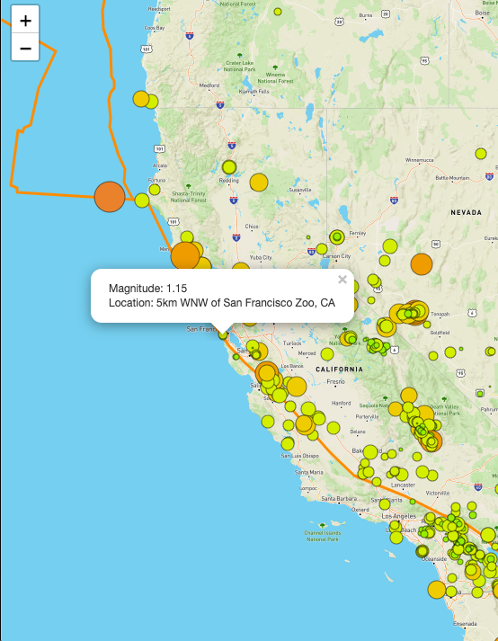

# Mapping Earthquakes

## Overview of Project
This project will use javascript, Leaflet.js and GeoJSON data to generate a map of recent earthquakes, the magnitudes and locations of the earthquakes, and tectonic plate locations. 

### Purpose
The map created is interactive and the user is able to toggle between various layers that showcases different information. By default, the map will display all data elements. If desired, the user can isolate to the information needed:
#### 1. The earthquake data from USGS for the past 7 days

#### 2. The tectonic plate locations

#### 3. Major earthquakes for the past 7 days

## Features
The default map style is “Streets”, and the map has two additional map styles:
#### 1. Satellite

#### 2. Dark

The map contains circle markers that vary in color and size. These differences corresponds to the legend in the bottom right corner, which references the magnitude of the earthquake. To access more information, users can click on each instance or circle marker on the map and be shown a popup that gives the magnitude and location specifics, as shown:

